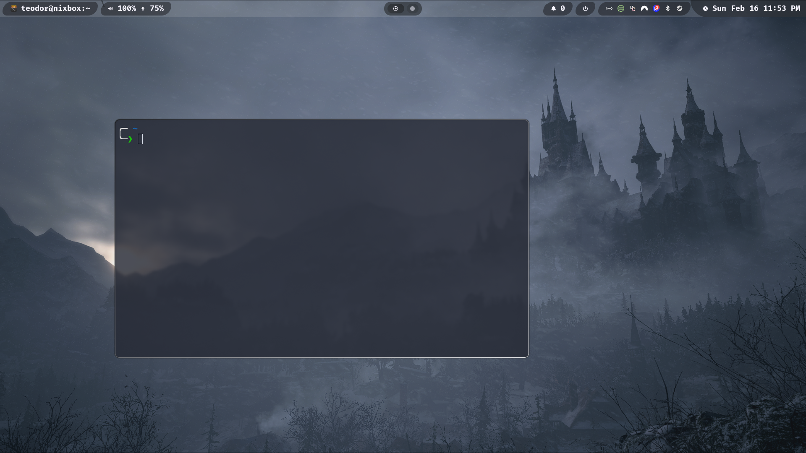

# 🌟 Teonix - A Modular NixOS & Home Manager Configuration

> 🚀 Your personal NixOS configuration, supercharged with customization and portability!

Teonix is a modular and customized NixOS configuration designed for seamless portability between different machines while keeping a consistent user experience. 

# 💻 Hyprland Rice overview



## 🎯 Features

- 🔧 Pre-configured system with sensible defaults
- 🏠 Integrated Home Manager setup
- 🎨 Custom dotfiles (Hyprland, Kitty, Quickshell on nixbox / Waybar elsewhere)
- 📦 Curated package selection
- 💻 Host-specific configurations (Desktop/Laptop/MacBook)
- 🔄 Easy synchronization between machines
- 🛠️ Convenient shell aliases and scripts

## 🚀 Quick Start

### 📥 1. Clone the Repository

Before installing Teonix, you must clone the repository into your home directory to ensure the shell aliases and scripts function properly:

```bash
cd ~
git clone https://github.com/teoscloud/teonix.git
cd teonix
```

This will create a `~/teonix` directory, which will be used by Home Manager and system scripts.

### ⚙️ 2. Choose Your Installation Type

#### 🎲 Default Setup (General Use)

The default installation provides the full Teonix experience, including:

✨ Customized dotfiles (Hyprland, Kitty, Waybar/Quickshell, etc.)  
🔧 Pre-configured system settings  
🏠 Home Manager nested in the NixOS flake (standalone `homeConfigurations` also available)  
🎮 No GPU passthrough or EDID patches required  

```bash
# 1. Ensure NixOS is installed
# 2. Generate hardware config (if missing):
sudo nixos-generate-config

# 3. Generate flake.lock
nix flake update

# 4. Apply Teonix (Home Manager is included — no separate switch required):
sudo nixos-rebuild switch --flake "path:."#$HOST --impure
```

#### 🖥️ Desktop Setup (Nixbox)

Perfect for desktop workstations with:

🎮 GPU Passthrough support (VFIO)  
🖥️ Custom EDID patches for monitor support  
🎯 Performance-focused configuration  

```bash
# 1. Install EDID firmware first!
cd ~/teonix/preinstallscripts
sudo ./edidinstall.sh

# 2. Generate flake.lock
nix flake update

# 3. Apply configuration (HM is nested; --impure for EDID / HOSTNAME):
sudo nixos-rebuild switch --flake "path:."#nixbox --impure
```

#### 💻 Laptop Setup (Nixtop)

Optimized for portable devices with:

🔋 Power management optimization  
💡 Brightness controls  
📱 Touchpad gestures  
🎮 No GPU passthrough needed  

```bash
# 1. Generate flake.lock
nix flake update

# 2. Apply configuration:
sudo nixos-rebuild switch --flake "path:."#nixtop --impure
```

#### 🍎 MacBook Setup (applenix — Apple Silicon)

Full nixbox-style Hyprland rice (Quickshell, hyprflow, PipeWire) on **aarch64-linux** via [nixos-apple-silicon](https://github.com/nix-community/nixos-apple-silicon):

🔋 Battery charge limit (80%) · 🖥️ Built-in panel · 🚫 No PC GPU/VFIO/BusChain  

See [`hosts/applenix/INSTALL.md`](hosts/applenix/INSTALL.md) for the fresh Asahi install runbook.

```bash
# After install + real hardware-configuration.nix:
sudo nixos-rebuild switch --flake "path:."#applenix --impure
home-manager switch --flake "path:."#applenix -b bak --impure
```

**`--impure`** is required until Asahi firmware under `/boot/asahi` is vendored into the flake (see INSTALL.md).

| Host | System | Flake attribute |
|------|--------|-----------------|
| nixbox | x86_64-linux | `#nixbox` |
| nixtop | x86_64-linux | `#nixtop` |
| default | x86_64-linux | `#$HOST` |
| applenix | aarch64-linux | `#applenix` |

## 🎨 Customization

### 🎯 Installing iOS Emojis

Get the Apple emoji experience:

```bash
cd ~/teonix/preinstallscripts
./iosemojis.sh
```

### ⌨️ Shell Aliases

Teonix comes with powerful zsh aliases for system management:

- 🔄 `systemupdate`: Full system update
- 🏠 `updatehome`: Update Home Manager only
- ⬆️ `nixupgrade`: Update NixOS without flake.lock
- 📦 `nixupdate`: Update flake dependencies

## 🔄 Syncing Between Machines

### 📤 Push Changes

```bash
git add .
git commit -m "✨ Updated Teonix configuration"
git push
```

### 📥 Pull Changes

```bash
cd ~/teonix
git pull
systemupdate
```

## 🎯 Requirements

- 📦 NixOS installed
- 🏠 Home Manager
- ⚡ Git
- 🔑 Basic Nix knowledge

## 🚨 Important Notes

- 📂 Always clone in `~` for proper alias functionality (might get fixed in the future)
- 🖥️ Custom EDID users: Don't forget `--impure` flag
- 🍎 applenix: `--impure` until Asahi firmware is in the flake (see `hosts/applenix/INSTALL.md`)
- 🔧 Default install: Perfect for general use
- 📚 Configs are modular (per host)

## 🤝 Contributing

Feel free to:
- 🐛 Report bugs
- 💡 Suggest features
- 🔧 Submit PRs
- 🌟 Star the repo if you like it!

## 📝 License

MIT License - Feel free to use and modify! 🎉

---
Made with 💝 by the Teo
